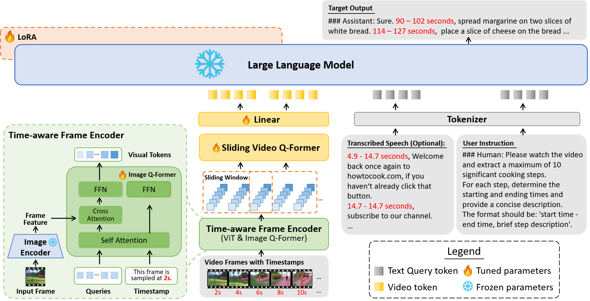
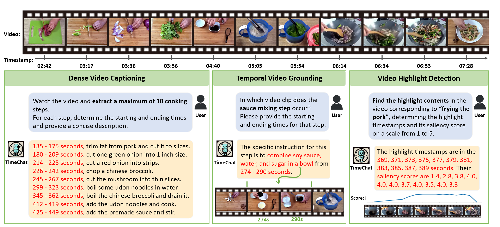
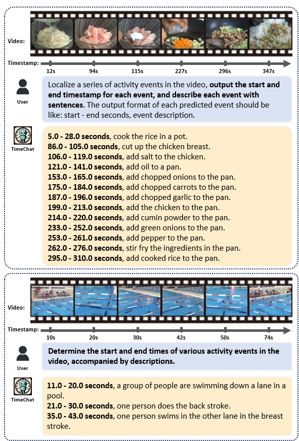
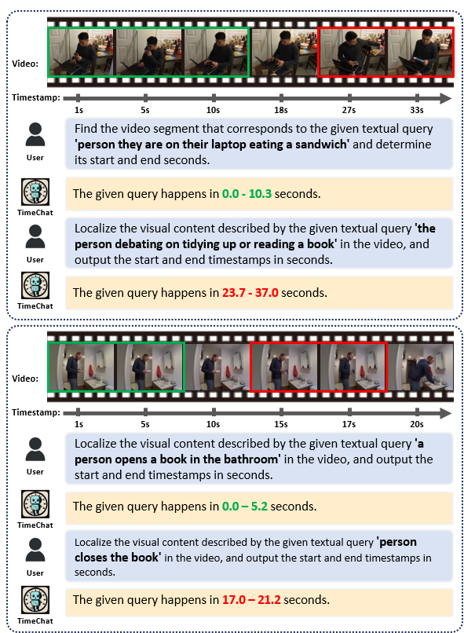
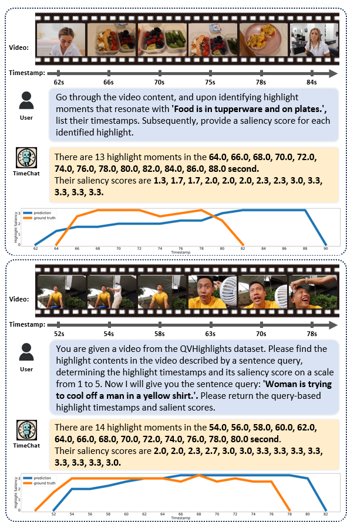

<p align="center" width="100%">
<a target="_blank"></a>
</p>


# TimeChat: A Time-sensitive Multimodal Large Language Model for Long Video Understanding
<!-- **TimeChat: A Time-sensitive Multimodal Large Language Model for Long Video Understanding** -->

<div style='display:flex; gap: 0.25rem; '>
<a href='https://arxiv.org/abs/2312.02051'></a>
</div>

## News
- [23.12.06] I am attending in EMNLP'23 and NeurIPS'23. I will take the time to continue to clean up the code and upload the ckpts & datasets. The open source will take one to two weeks, stay tuned please.
- [23.12.06] Release the initial version of **TimeChat**. 

<p align="center" width="100%">
<a target="_blank"></a>
</p>

## Introduction

- **TimeChat** is a time-sensitive multimodal large language model specifically designed for long video understanding. Our model incorporates two key architectural contributions: 
  - (1) a timestamp-aware frame encoder that binds visual content with the timestamp of each frame
  - (2) a sliding video Q-Former that produces a video token sequence of varying lengths to accommodate videos of various durations. 
- We also construct an instruction-tuning dataset named **TimeIT**, encompassing 6 tasks and a total of 125K instances, to further enhance TimeChat's instruction-following performance.


## Example Outputs
- **An illustration of temporal localization capability of TimeChat**

<p float="left">
    
</p>

- **Examples for dense video captioning (left), temporal video grounding (middle), and video highlight detection (right)**

<p float="left">
    
    
    
</p>


## Fine-tuned Checkpoints

coming soon


## Usage
#### Enviroment Preparation 

First, install ffmpeg.
```
apt update
apt install ffmpeg
```
Then, create a conda environment:
```
conda env create -f environment.yml
conda activate timechat
```


## Prerequisites

Before fine-tuning your own model (or reproduce our TimeChat model), make sure you have obtained the following checkpoints:

#### Pre-trained Image Encoder (EVA ViT-g)
```bash
wget https://storage.googleapis.com/sfr-vision-language-research/LAVIS/models/BLIP2/eva_vit_g.pth
```

#### Pre-trained Image Q-Former (InstructBLIP Q-Former)
```bash
wget https://storage.googleapis.com/sfr-vision-language-research/LAVIS/models/InstructBLIP/instruct_blip_vicuna7b_trimmed.pth
```

#### Pre-trained Language Decoder (LLaMA-2-7B) and Video Encoder (Video Q-Former of Video-LLaMA)

Use `git-lfs` to download weights of [Video-LLaMA (7B)](https://huggingface.co/DAMO-NLP-SG/Video-LLaMA-2-7B-Finetuned/tree/main):
```bash
git lfs install
git clone https://huggingface.co/DAMO-NLP-SG/Video-LLaMA-2-7B-Finetuned
```

The file structure looks like:
```
ckpt/
|–– Video-LLaMA-2-7B-Finetuned/
    |-- llama-2-7b-chat-hf/
    |-- VL_LLaMA_2_7B_Finetuned.pth
|–– instruct-blip/
    |-- instruct_blip_vicuna7b_trimmed.pth
|–– blip2/
    |-- eva_vit_g.pth
```

## How to Run Demo Locally

coming soon

## Instruction-Tuning

### Data
For now, the fine-tuning dataset consists of:
* 104K time-sensitive instructions that our collected (coming soon)
* 73K video-based instructions from Valley [[link](https://huggingface.co/datasets/luoruipu1/Valley-Instruct-73k)]

### Script

#### Tuning
Config the checkpoint and dataset paths in [stage2_finetune_time104k_asr_valley72k.yaml](./train_configs/stage2_finetune_time104k_asr_valley72k.yaml).
```
conda activate timechat
torchrun --nproc_per_node=8 train.py --cfg-path  train_configs/stage2_finetune_time104k_asr_valley72k.yaml
```

#### Evaluation
Config the checkpoint and dataset paths in [timechat.yaml](./eval_configs/timechat.yaml).

Config the downstream task in [eval.sh](eval.sh).
```
bash eval.sh
```

## Recommended GPUs
* Instruction-tuning: 8xV100 (32G)
* Inference: 1xA100 (40G/80G) or 1xA6000

## Acknowledgement
We are grateful for the following awesome projects our TimeChat arising from:
* [Video-LLaMA](https://github.com/DAMO-NLP-SG/Video-LLaMA): An Instruction-tuned Audio-Visual Language Model for Video Understanding
* [MiniGPT-4](https://github.com/Vision-CAIR/MiniGPT-4): Enhancing Vision-language Understanding with Advanced Large Language Models
* [FastChat](https://github.com/lm-sys/FastChat): An Open Platform for Training, Serving, and Evaluating Large Language Model based Chatbots
* [BLIP-2](https://github.com/salesforce/LAVIS/tree/main/projects/blip2): Bootstrapping Language-Image Pre-training with Frozen Image Encoders and Large Language Models 
* [EVA-CLIP](https://github.com/baaivision/EVA/tree/master/EVA-CLIP): Improved Training Techniques for CLIP at Scale
* [LLaMA](https://github.com/facebookresearch/llama): Open and Efficient Foundation Language Models
* [VideoChat](https://github.com/OpenGVLab/Ask-Anything): Chat-Centric Video Understanding
* [LLaVA](https://github.com/haotian-liu/LLaVA): Large Language and Vision Assistant


## Term of Use
Our TimeChat is just a research preview intended for non-commercial use only. You must **NOT** use our TimeChat for any illegal, harmful, violent, racist, or sexual purposes. You are strictly prohibited from engaging in any activity that will potentially violate these guidelines. 

## Citation
If you find our project useful, hope you can star our repo and cite our paper as follows:
```
@inproceedings{Ren2023TimeChat,
  title={TimeChat: A Time-sensitive Multimodal Large Language Model for Long Video Understanding},
  author={Shuhuai Ren and Linli Yao and Shicheng Li and Xu Sun and Lu Hou},
  year={2023},
  journal={arXiv preprint arXiv:2312.02051},
}
```

