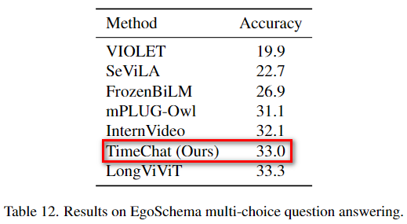
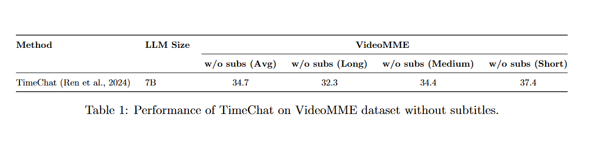

# Zero-shot Evaluation Results

**Tips** 🚀: We decrease `lora_alpha` from `32` to `20` during inference to restore the model's language capabilities, which is very helpful for benchmarks in QA forms. 
Please refer to [FAQ.md](https://github.com/RenShuhuai-Andy/TimeChat/blob/master/docs/FAQ.md#3-how-to-better-instruct-the-model-to-perform-qa-or-other-specialized-tasks) for details.

## TempCompass
link: https://github.com/llyx97/TempCompass

leaderboard: https://huggingface.co/spaces/lyx97/TempCompass

evaluation scripts:

1. firstly reset `MODEL_DIR`, `ANNO_DIR`, and `VIDEO_DIR` in `eval_tempcompass.sh`

2. run:
    ```bash
    cd benchmark
    sh eval_tempcompass.sh
    ```

results:
<p float="left">
    
</p>

## MVBench
link: https://github.com/OpenGVLab/Ask-Anything/tree/main/video_chat2

leaderboard: https://huggingface.co/spaces/OpenGVLab/MVBench_Leaderboard

evaluation scripts:

1. firstly reset `MODEL_DIR`, `ANNO_DIR`, and `VIDEO_DIR` in `eval_mvbench.sh`

2. run:
    ```bash
    cd benchmark
    sh eval_mvbench.sh
    ```

results:
<p float="left">
    
</p>

## EgoSchema

link: https://github.com/egoschema/EgoSchema

leaderboard: https://www.kaggle.com/competitions/egoschema-public/overview

evaluation scripts:

1. firstly reset `MODEL_DIR`, `ANNO_DIR`, and `VIDEO_DIR` in `eval_egoschema.sh`

2. run:
    ```bash
    cd benchmark
    sh eval_egoschema.sh
    ```

results:
<p float="left">
    
</p>

## VideoMME

link:https://github.com/BradyFU/Video-MME

leaderboard:https://huggingface.co/datasets/lmms-lab/Video-MME

evaluation scripts:

1. firstly reset `MODEL_DIR`, `ANNO_DIR`, and `VIDEO_DIR` in `eval_videomme.sh`

2. run:
    ```bash
    cd benchmark
    sh videomme.sh
    ```

results:
<p float="left">
    
</p>
