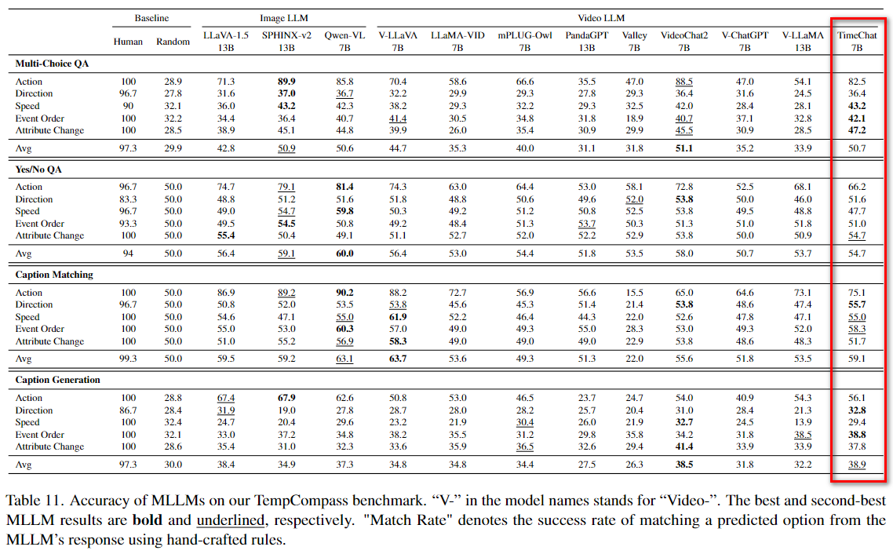
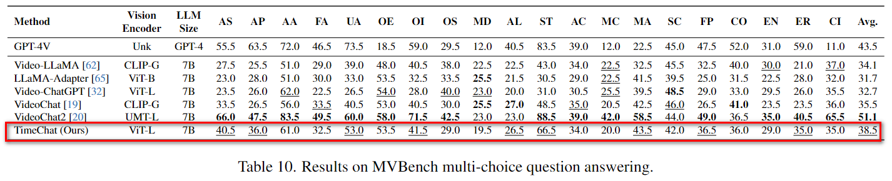

# Evaluation Results

## TempCompass
link: https://github.com/llyx97/TempCompass

leaderboard: https://huggingface.co/spaces/lyx97/TempCompass

evaluation scripts:

1. firstly reset `MODEL_DIR`, `ANNO_DIR`, and `VIDEO_DIR` in `eval_tempcompass.sh`

2. run:
    ```bash
    cd benchmark
    sh eval_tempcompass.sh
    ```

results:
<p float="left">
    
</p>

## MVBench
link: https://github.com/OpenGVLab/Ask-Anything/tree/main/video_chat2

leaderboard: https://huggingface.co/spaces/OpenGVLab/MVBench_Leaderboard

evaluation scripts:

1. firstly reset `MODEL_DIR`, `ANNO_DIR`, and `VIDEO_DIR` in `eval_mvbench.sh`

2. run:
    ```bash
    cd benchmark
    sh eval_mvbench.sh
    ```

results:
results:
<p float="left">
    
</p>

## EgoSchema

TBD

## VideoMME

TBD